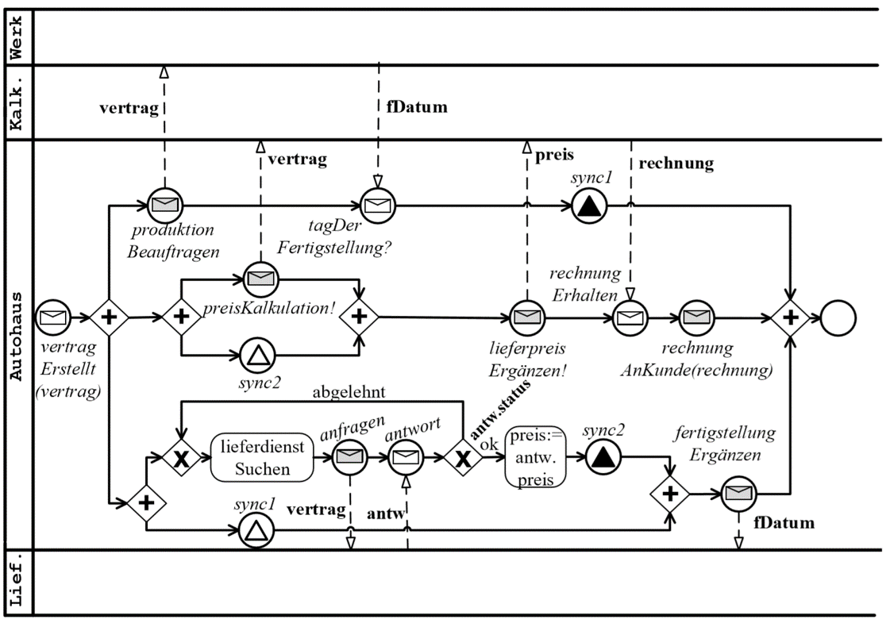

# Exercise 1

This first exercise creates the car dealership process pool (3rd pool from the top).

1. Create a .bpmn diagram for the car dealership pool
2. Use ‘Send tasks’ for sending messages, ‘Service Tasks’ for every other activity
3. Create the java delegates in the package `de.patst.process.delegate`
    * in the beginning the Java delegates can be empty or just write a log message, just to get the process running

4. Create a class diagram for the business objects in the car dealership process. Potential business objects are objects send/ received in all events, e.g.:
    * Start message
    * Message events
    * Signal events
    * Send tasks
    
5. Create the java classes described in the class diagram in the package `de.patst.process.model`.

6. Write a JUnit test which tests a successful execution of the process. At the moment the other pools do not exist. 
Therefore we have to send signals and set variables manually in the unit test.
    a. Send the signal events from the test code (Use the RuntimeService) 
    b. Add variables where needed to the process instance (RuntimeService)

7. There is a form to create a new car contract in the browser at http://localhost:8080/index.html .
The form does not yet call the process engine to create the process instance. 
The call needs to be implemented in the Javascript file at `src/main/resources/static/create_contract.js`.
There are two links. One is the CamundaBPM API description and the other link shows an example how to call a REST API with Javascript.