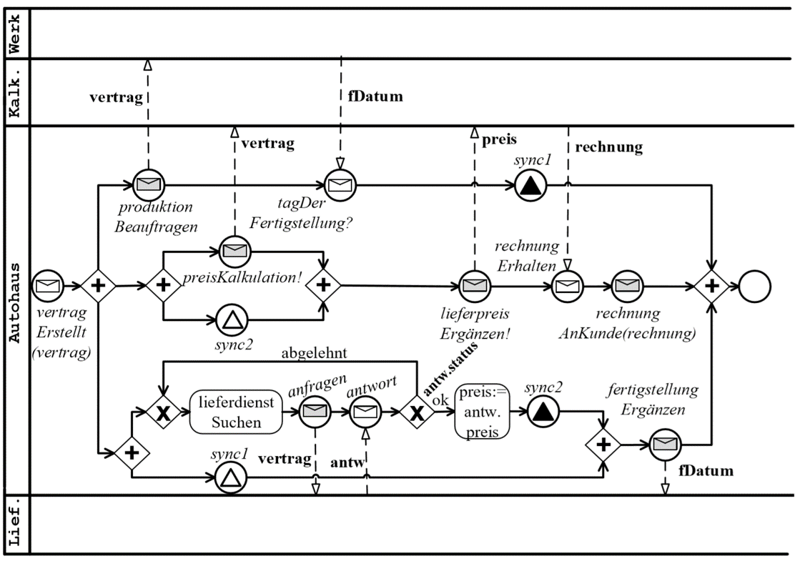

# Exercise 1

* Create a .bpmn diagram for the car dealership pool
* Use ‘Send tasks’ for sending messages, ‘Service Tasks’ for every other activity
* Create the java delegates in the package `de.patst.process.delegate`
    * in the beginning the Java delegates can be empty or just write a log message, just to get the process running

* Create a class diagram for the business objects in the car dealership process. Potential business objects are objects send/ received in all events, e.g.:
    * Start message
    * Message events
    * Signal events
    * Send tasks
    
* Create the java classes described in the class diagram in the package `de.patst.process.model`.

* Write a JUnit test which tests a successful execution of the process
    * Send the signal events from the test code (Use the RuntimeService) 
    * Add variables where needed to the process instance (RuntimeService)
